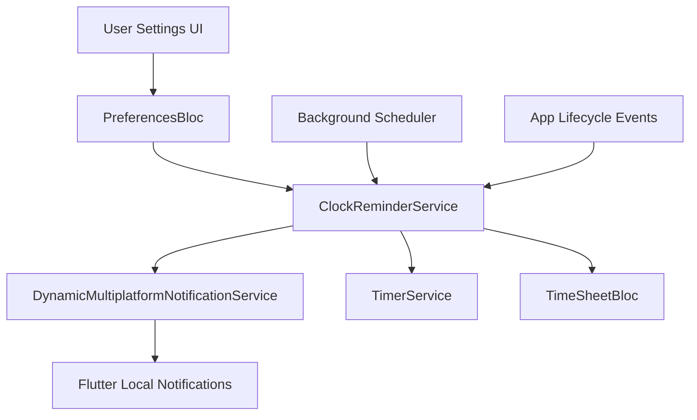

# Design Document

## Overview

The Clock Reminder Notifications feature will integrate with the existing notification system to provide configurable reminders for employees to clock in/out. The system will be built on top of the existing `DynamicMultiplatformNotificationService` and will integrate with the preferences system to allow users to configure their reminder settings.

The feature will be disabled by default and will provide intelligent context-aware reminders that respect the user's current clock status and work schedule.

## Architecture

### High-Level Architecture



### Integration Points

1. **PreferencesBloc**: Extended to handle reminder notification settings
2. **DynamicMultiplatformNotificationService**: Enhanced to support reminder notifications
3. **TimerService**: Provides current clock status for intelligent reminders
4. **TimeSheetBloc**: Provides timesheet state for context-aware notifications
5. **Settings UI**: New section for configuring reminder preferences

## Components and Interfaces

### 1. ClockReminderService

**Purpose**: Core service managing reminder scheduling and intelligent notification logic.

**Key Responsibilities**:
- Schedule and cancel reminder notifications
- Monitor clock status changes
- Validate reminder configurations
- Handle app lifecycle events

**Interface**:
```dart
class ClockReminderService {
  Future<void> initialize();
  Future<void> scheduleReminders(ReminderSettings settings);
  Future<void> cancelAllReminders();
  Future<void> onClockStatusChanged(String status);
  Future<void> onAppBackground();
  Future<void> onAppForeground();
  void dispose();
}
```

### 2. ReminderSettings Model

**Purpose**: Data model for reminder configuration.

**Properties**:
```dart
class ReminderSettings {
  final bool enabled;
  final TimeOfDay clockInTime;
  final TimeOfDay clockOutTime;
  final Set<int> activeDays; // 1-7 (Monday-Sunday)
  final bool respectHolidays;
  final int snoozeMinutes;
  final int maxSnoozes;
}
```

### 3. Enhanced PreferencesBloc

**New Events**:
- `SaveReminderSettings`
- `LoadReminderSettings`
- `ToggleReminders`

**New State Properties**:
- `ReminderSettings? reminderSettings`

### 4. ReminderNotificationHandler

**Purpose**: Handles notification interactions and routing.

**Responsibilities**:
- Process notification taps
- Handle snooze functionality
- Route to appropriate app screens

## Data Models

### ReminderSettings
```dart
class ReminderSettings {
  final bool enabled;
  final TimeOfDay clockInTime;
  final TimeOfDay clockOutTime;
  final Set<int> activeDays;
  final bool respectHolidays;
  final int snoozeMinutes;
  final int maxSnoozes;
  
  // Serialization methods
  Map<String, dynamic> toJson();
  factory ReminderSettings.fromJson(Map<String, dynamic> json);
  
  // Default settings
  static ReminderSettings get defaultSettings;
}
```

### ReminderNotification
```dart
class ReminderNotification {
  final int id;
  final ReminderType type;
  final DateTime scheduledTime;
  final String title;
  final String body;
  final String payload;
  final int snoozeCount;
}

enum ReminderType {
  clockIn,
  clockOut,
}
```

## Error Handling

### Permission Handling
- Check notification permissions before scheduling
- Provide clear user guidance for enabling permissions
- Graceful degradation when permissions are denied
- Automatic retry when permissions are granted

### Scheduling Failures
- Validate reminder times before scheduling
- Handle platform-specific scheduling limitations
- Provide user feedback for configuration errors
- Fallback to basic reminders if advanced features fail

### State Synchronization
- Handle app state changes during notification delivery
- Sync reminder status with actual clock status
- Recover from inconsistent states
- Validate clock status before sending reminders

## Testing Strategy

### Unit Tests
1. **ReminderSettings Model Tests**
   - Serialization/deserialization
   - Validation logic
   - Default values

2. **ClockReminderService Tests**
   - Reminder scheduling logic
   - Clock status integration
   - Permission handling
   - App lifecycle management

3. **PreferencesBloc Tests**
   - Reminder settings persistence
   - State management
   - Error handling

### Integration Tests
1. **Notification Flow Tests**
   - End-to-end reminder delivery
   - Notification interaction handling
   - App navigation from notifications

2. **Clock Status Integration Tests**
   - Reminder cancellation on manual clock actions
   - Status-aware reminder logic
   - Weekend/holiday handling

### Widget Tests
1. **Settings UI Tests**
   - Reminder configuration interface
   - Time picker interactions
   - Day selection functionality
   - Permission request flows

### Platform-Specific Tests
1. **iOS Notification Tests**
   - Badge management
   - Background delivery
   - Permission handling

2. **Android Notification Tests**
   - Channel configuration
   - Battery optimization handling
   - Notification grouping

## Implementation Phases

### Phase 1: Core Infrastructure
- Create ReminderSettings model
- Extend PreferencesBloc for reminder settings
- Implement basic ClockReminderService
- Add settings UI components

### Phase 2: Notification Integration
- Enhance DynamicMultiplatformNotificationService
- Implement reminder scheduling logic
- Add notification interaction handling
- Integrate with existing permission system

### Phase 3: Intelligence Features
- Add clock status awareness
- Implement weekend/holiday detection
- Add snooze functionality
- Integrate with TimerService and TimeSheetBloc

### Phase 4: Polish and Testing
- Comprehensive testing suite
- Performance optimization
- Error handling refinement
- User experience improvements

## Security Considerations

- Store reminder settings locally using existing secure storage
- No sensitive data in notification payloads
- Validate all user inputs for reminder configuration
- Respect system-level notification permissions

## Performance Considerations

- Minimize background processing
- Efficient notification scheduling
- Lazy loading of reminder settings
- Optimal memory usage for notification handlers

## Platform-Specific Considerations

### iOS
- Leverage existing badge management system
- Use UNNotificationCategory for reminder actions
- Handle app lifecycle transitions properly
- Respect iOS notification delivery limitations

### Android
- Create dedicated notification channel for reminders
- Handle battery optimization settings
- Support notification grouping
- Manage notification importance levels

### Desktop (Windows/Linux)
- Adapt existing Windows notification system
- Provide fallback for unsupported features
- Handle system sleep/wake cycles