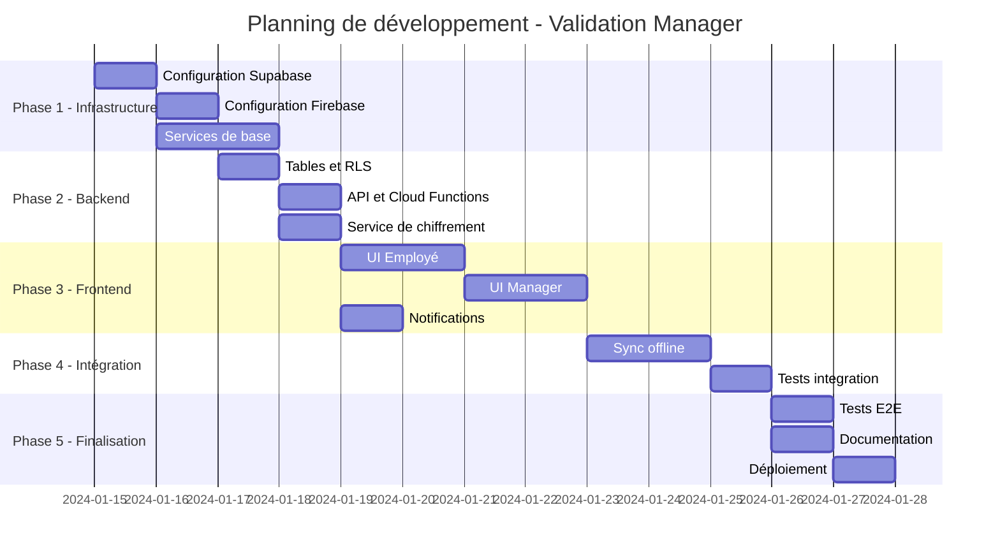

# Planning et Estimations - Système de Validation Manager

## Vue d'ensemble du planning

### Timeline globale (10-15 jours)

## Découpage détaillé par phase

### Phase 1 : Infrastructure (2.5 jours)

| Tâche | Description | Durée | Dépendances | Risques |
|-------|-------------|-------|-------------|---------|
| INFRA-01 | Configuration projet Supabase | 0.5j | - | Limites plan gratuit |
| INFRA-02 | Création tables et RLS | 0.5j | INFRA-01 | Complexité des règles |
| INFRA-03 | Configuration Firebase | 0.5j | - | Quotas notifications |
| INFRA-04 | Services sécurité/chiffrement | 1j | - | Performance chiffrement |

### Phase 2 : Backend (3 jours)

| Tâche | Description | Durée | Dépendances | Risques |
|-------|-------------|-------|-------------|---------|
| BACK-01 | Repository Supabase | 1j | INFRA-02 | API changes |
| BACK-02 | Cloud Functions FCM | 1j | INFRA-03 | Latence notifications |
| BACK-03 | Service upload/download | 0.5j | BACK-01 | Taille des PDFs |
| BACK-04 | Gestion des erreurs | 0.5j | BACK-01,02 | Edge cases |

### Phase 3 : Frontend (5 jours)

| Tâche | Description | Durée | Dépendances | Risques |
|-------|-------------|-------|-------------|---------|
| FRONT-01 | Page soumission employé | 1j | BACK-01 | UX complexe |
| FRONT-02 | Intégration PDF existant | 0.5j | FRONT-01 | Compatibilité |
| FRONT-03 | Page validation manager | 1.5j | BACK-01 | Signature sur mobile |
| FRONT-04 | Liste validations | 1j | FRONT-03 | Performance listes |
| FRONT-05 | Système de feedback | 1j | FRONT-03 | Workflow complexe |

### Phase 4 : Intégration (2.5 jours)

| Tâche | Description | Durée | Dépendances | Risques |
|-------|-------------|-------|-------------|---------|
| INT-01 | Sync offline | 1.5j | FRONT-01,03 | Conflits de données |
| INT-02 | Tests intégration | 0.5j | INT-01 | Cas non couverts |
| INT-03 | Optimisations | 0.5j | INT-02 | Performance mobile |

### Phase 5 : Finalisation (1.5 jours)

| Tâche | Description | Durée | Dépendances | Risques |
|-------|-------------|-------|-------------|---------|
| FIN-01 | Tests E2E | 0.5j | Toutes | Environnements tests |
| FIN-02 | Documentation | 0.5j | Toutes | Maintenabilité |
| FIN-03 | Déploiement | 0.5j | FIN-01 | Stores validation |

## Estimations par développeur

### Profil Senior (10 jours)
- Familier avec Flutter, Supabase, Firebase
- Expérience en sécurité et chiffrement
- Capable de travailler en autonomie

### Profil Intermédiaire (15 jours)
- Connaissance Flutter solide
- Besoin de support sur Supabase/Firebase
- Revue de code nécessaire

### Équipe de 2 développeurs (7-8 jours)
- 1 Senior + 1 Intermédiaire
- Travail en parallèle possible
- Meilleure couverture des tests

## Budget estimé

### Coûts de développement

| Ressource | Quantité | Coût unitaire | Total |
|-----------|----------|---------------|-------|
| Dev Senior | 10 jours | 800 CHF/jour | 8,000 CHF |
| Dev Intermédiaire | 5 jours | 600 CHF/jour | 3,000 CHF |
| Chef de projet | 3 jours | 1,000 CHF/jour | 3,000 CHF |
| **Total développement** | | | **14,000 CHF** |

### Coûts infrastructure (mensuel)

| Service | Plan | Coût/mois | Notes |
|---------|------|-----------|-------|
| Supabase | Free → Pro | 0 → 25$ | Si > 500MB storage |
| Firebase | Spark → Blaze | 0 → 10$ | Si > 10k notifs/mois |
| Monitoring | - | 20$ | Optionnel |
| **Total/mois** | | **0-55$** | Selon usage |

### ROI estimé

- **Gain de temps** : 2-3 jours → 2-3 heures par validation
- **Productivité** : +30% sur le processus de validation
- **Erreurs évitées** : -80% grâce aux notifications automatiques
- **Rentabilité** : 3-4 mois avec 50+ validations/mois

## Risques et mitigation

### Risques techniques

| Risque | Probabilité | Impact | Mitigation |
|--------|-------------|--------|------------|
| Performance chiffrement sur mobile | Moyenne | Élevé | Tests sur appareils anciens, optimisation algorithme |
| Limite taille PDF | Faible | Moyen | Compression adaptative, chunking |
| Conflits sync offline | Moyenne | Élevé | Stratégie de résolution claire, tests exhaustifs |
| Compatibilité iOS/Android | Faible | Moyen | Tests sur multiples versions OS |

### Risques organisationnels

| Risque | Probabilité | Impact | Mitigation |
|--------|-------------|--------|------------|
| Résistance au changement | Moyenne | Élevé | Formation, déploiement progressif |
| RGPD/Compliance | Faible | Très élevé | Audit juridique, DPO consultation |
| Adoption managers | Moyenne | Élevé | UX optimale, onboarding guidé |

## Métriques de succès

### KPIs techniques
- ✅ Temps moyen de validation < 5 minutes
- ✅ Taux de succès upload > 99%
- ✅ Latence notifications < 5 secondes
- ✅ Disponibilité service > 99.5%

### KPIs business
- ✅ Adoption > 80% après 1 mois
- ✅ Réduction délai validation de 70%
- ✅ Satisfaction utilisateur > 4/5
- ✅ 0 incident sécurité

## Planning de déploiement

### Semaine 1-2 : Développement
- Sprint 1 : Infrastructure + Backend
- Sprint 2 : Frontend + Intégration

### Semaine 3 : Tests et stabilisation
- Tests avec utilisateurs pilotes (5-10)
- Corrections bugs
- Optimisations performance

### Semaine 4 : Déploiement progressif
- Phase 1 : 10% des utilisateurs
- Phase 2 : 50% des utilisateurs
- Phase 3 : 100% des utilisateurs

## Livrables

### Documentation
- [ ] Guide d'installation Supabase/Firebase
- [ ] Documentation API
- [ ] Guide utilisateur employé
- [ ] Guide utilisateur manager
- [ ] Procédures de support

### Code
- [ ] Repository Git avec branches
- [ ] CI/CD configuré
- [ ] Tests automatisés (>80% coverage)
- [ ] Code review effectuée

### Formation
- [ ] Vidéos de démonstration
- [ ] Sessions de formation managers
- [ ] FAQ et troubleshooting

## Maintenance et évolution

### Maintenance (2 jours/mois)
- Monitoring et alertes
- Corrections bugs
- Mises à jour sécurité
- Support utilisateurs

### Évolutions futures
1. **v1.1** : Workflow multi-niveaux (3 jours)
2. **v1.2** : Dashboard analytics (5 jours)
3. **v1.3** : Intégration ERP (10 jours)
4. **v2.0** : Web app complète (20 jours)

## Conclusion

Le projet est techniquement réalisable dans les délais proposés avec les bonnes ressources. Les principaux facteurs de succès sont :

1. **Configuration rapide** des services cloud
2. **Réutilisation maximale** du code existant
3. **Tests continus** pendant le développement
4. **Communication claire** avec les utilisateurs

Le ROI est rapidement atteint grâce aux gains de productivité importants. La solution est évolutive et peut s'adapter aux besoins futurs de l'organisation.