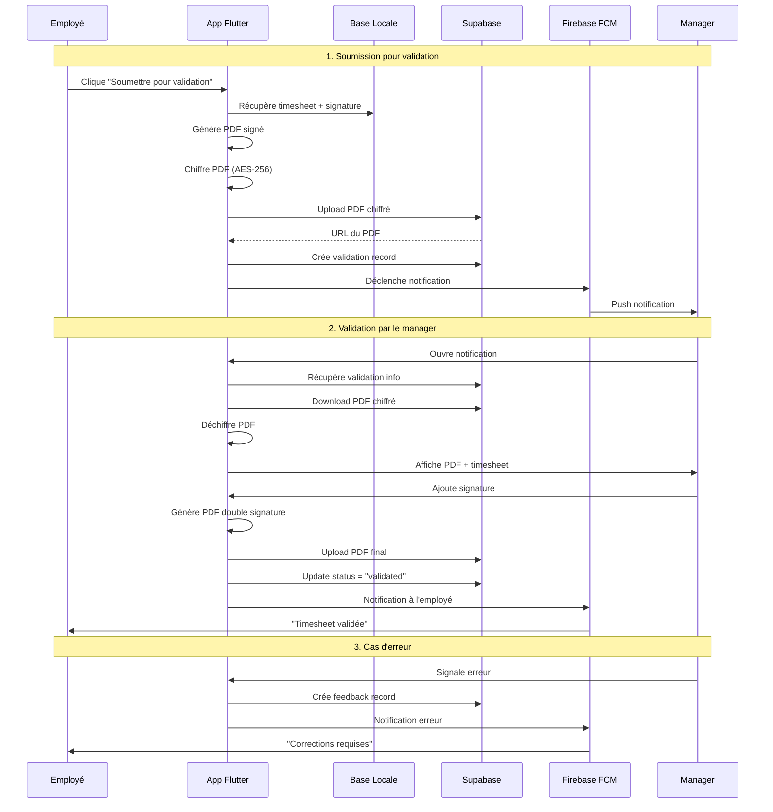

# Flux de Données - Système de Validation

## Diagramme de flux principal



## États de la validation

```
┌─────────────┐     ┌─────────────┐     ┌──────────────┐
│   DRAFT     │────▶│  SUBMITTED  │────▶│  VALIDATED   │
└─────────────┘     └─────────────┘     └──────────────┘
                            │                     │
                            │                     │
                            ▼                     ▼
                    ┌─────────────┐      ┌──────────────┐
                    │   ERROR     │      │  EXPORTED    │
                    └─────────────┘      └──────────────┘
                            │
                            ▼
                    ┌─────────────┐
                    │  CORRECTED  │
                    └─────────────┘
```

## Flux détaillés par scénario

### 1. Soumission initiale (Employé)

```dart
// Flux dans ValidationService
class ValidationService {
  Future<ValidationResult> submitForValidation({
    required TimesheetEntry timesheet,
    required String managerId,
  }) async {
    try {
      // 1. Vérifications préalables
      _validateTimesheet(timesheet);
      _validateManager(managerId);
      
      // 2. Génération du PDF avec signature employé
      final employeeSignature = await _signatureService.getEmployeeSignature();
      final pdfBytes = await _pdfGenerator.generate(
        timesheet: timesheet,
        signature: employeeSignature,
      );
      
      // 3. Chiffrement
      final encryptedPdf = await _encryptionService.encrypt(
        data: pdfBytes,
        key: await _getOrganizationKey(),
      );
      
      // 4. Upload vers Supabase
      final timestamp = DateTime.now().millisecondsSinceEpoch;
      final fileName = 'timesheet_${timesheet.userId}_$timestamp.pdf';
      
      final pdfUrl = await _supabase.storage
        .from('timesheet-pdfs')
        .uploadBinary(
          'pending/$fileName',
          encryptedPdf,
          fileOptions: FileOptions(
            contentType: 'application/pdf',
            upsert: false,
          ),
        );
      
      // 5. Création de l'enregistrement de validation
      final validation = await _supabase
        .from('timesheet_validations')
        .insert({
          'id': Uuid().v4(),
          'employee_id': timesheet.userId,
          'manager_id': managerId,
          'organization_id': _currentOrganizationId,
          'timesheet_data': timesheet.toJson(),
          'pdf_url': pdfUrl,
          'status': 'submitted',
          'submitted_at': DateTime.now().toIso8601String(),
          'expires_at': DateTime.now().add(Duration(days: 30)).toIso8601String(),
        })
        .select()
        .single();
      
      // 6. Déclenchement de la notification
      await _notificationService.notifyManager(
        managerId: managerId,
        validationId: validation['id'],
        employeeName: await _getUserName(),
        period: '${timesheet.month}/${timesheet.year}',
      );
      
      // 7. Mise à jour du cache local
      await _updateLocalCache(validation);
      
      return ValidationResult.success(
        validationId: validation['id'],
        message: 'Timesheet soumise avec succès',
      );
      
    } catch (e) {
      // Gestion d'erreur avec rollback si nécessaire
      return ValidationResult.error(
        message: 'Erreur lors de la soumission: ${e.toString()}',
      );
    }
  }
}
```

### 2. Réception et traitement (Manager)

```dart
// Flux dans ManagerValidationService
class ManagerValidationService {
  StreamSubscription? _notificationSubscription;
  
  void initialize() {
    // Écoute des notifications FCM
    _notificationSubscription = FirebaseMessaging.onMessage.listen((message) {
      if (message.data['type'] == 'validation_request') {
        _handleValidationNotification(message.data);
      }
    });
    
    // Gestion des notifications en arrière-plan
    FirebaseMessaging.onBackgroundMessage(_backgroundHandler);
  }
  
  Future<void> _handleValidationNotification(Map<String, dynamic> data) async {
    final validationId = data['validation_id'];
    
    // 1. Récupération des détails
    final validation = await _fetchValidationDetails(validationId);
    
    // 2. Téléchargement et déchiffrement du PDF
    final pdfData = await _downloadAndDecryptPdf(validation['pdf_url']);
    
    // 3. Affichage dans l'UI
    _navigationService.navigateTo(
      ManagerValidationScreen(
        validation: validation,
        pdfData: pdfData,
      ),
    );
  }
  
  Future<ValidationResponse> validateTimesheet({
    required String validationId,
    required Uint8List managerSignature,
    String? comments,
  }) async {
    try {
      // 1. Récupération du PDF original
      final validation = await _getValidation(validationId);
      final originalPdf = await _downloadAndDecryptPdf(validation['pdf_url']);
      
      // 2. Ajout de la signature du manager
      final doublySigned = await _pdfService.addSecondSignature(
        pdfBytes: originalPdf,
        signature: managerSignature,
        position: SignaturePosition.bottomRight,
        signerInfo: {
          'name': await _getManagerName(),
          'role': 'Delivery Manager',
          'date': DateTime.now().toIso8601String(),
        },
      );
      
      // 3. Chiffrement et upload du PDF final
      final encryptedFinal = await _encryptionService.encrypt(doublySigned);
      final finalUrl = await _uploadFinalPdf(validationId, encryptedFinal);
      
      // 4. Mise à jour du statut
      await _updateValidationStatus(
        validationId: validationId,
        status: 'validated',
        signedPdfUrl: finalUrl,
        comments: comments,
      );
      
      // 5. Notification à l'employé
      await _notifyEmployee(
        validation['employee_id'],
        'Votre timesheet a été validée',
      );
      
      return ValidationResponse.success();
      
    } catch (e) {
      return ValidationResponse.error(e.toString());
    }
  }
}
```

### 3. Gestion des erreurs et corrections

```dart
// Service de feedback
class FeedbackService {
  Future<void> reportErrors({
    required String validationId,
    required List<TimesheetError> errors,
    required String generalComment,
  }) async {
    // 1. Création du rapport d'erreurs
    final feedback = {
      'id': Uuid().v4(),
      'validation_id': validationId,
      'type': 'error',
      'errors': errors.map((e) => {
        'date': e.date.toIso8601String(),
        'field': e.field,
        'message': e.message,
      }).toList(),
      'general_comment': generalComment,
      'created_at': DateTime.now().toIso8601String(),
      'created_by': await _getCurrentUserId(),
    };
    
    // 2. Sauvegarde dans Supabase
    await _supabase
      .from('validation_feedback')
      .insert(feedback);
    
    // 3. Mise à jour du statut de validation
    await _supabase
      .from('timesheet_validations')
      .update({'status': 'error'})
      .eq('id', validationId);
    
    // 4. Notification push à l'employé
    final validation = await _getValidation(validationId);
    await _fcmService.sendNotification(
      to: validation['employee_id'],
      notification: {
        'title': 'Corrections requises',
        'body': 'Votre timesheet nécessite des corrections',
        'data': {
          'type': 'error_feedback',
          'validation_id': validationId,
          'feedback_id': feedback['id'],
        },
      },
    );
    
    // 5. Email de suivi (optionnel)
    if (_shouldSendEmail()) {
      await _emailService.sendErrorNotification(
        to: await _getEmployeeEmail(validation['employee_id']),
        errors: errors,
        comment: generalComment,
      );
    }
  }
}
```

### 4. Synchronisation offline

```dart
// Gestionnaire de synchronisation
class OfflineSyncManager {
  final Queue<PendingOperation> _queue = Queue();
  Timer? _syncTimer;
  
  void initialize() {
    // Vérification périodique de la connexion
    _syncTimer = Timer.periodic(Duration(seconds: 30), (_) {
      if (_hasConnection()) {
        _processPendingOperations();
      }
    });
    
    // Écoute des changements de connectivité
    Connectivity().onConnectivityChanged.listen((result) {
      if (result != ConnectivityResult.none) {
        _processPendingOperations();
      }
    });
  }
  
  Future<void> addOperation(PendingOperation operation) async {
    // 1. Ajout à la queue
    _queue.add(operation);
    
    // 2. Sauvegarde locale
    await _isar.writeTxn(() async {
      await _isar.pendingOperations.put(operation.toIsar());
    });
    
    // 3. Tentative immédiate si online
    if (_hasConnection()) {
      await _processOperation(operation);
    }
  }
  
  Future<void> _processPendingOperations() async {
    final operations = await _loadPendingOperations();
    
    for (final op in operations) {
      try {
        await _processOperation(op);
        await _markAsCompleted(op.id);
      } catch (e) {
        await _incrementRetryCount(op.id);
        
        if (op.retryCount > 3) {
          await _markAsFailed(op.id, e.toString());
        }
      }
    }
  }
}
```

## Optimisations du flux

### 1. Pré-chargement intelligent

```dart
// Précharge les données probables
class PreloadService {
  void preloadManagerData() {
    // Précharge les validations en attente
    _supabase
      .from('timesheet_validations')
      .select()
      .eq('manager_id', _currentUserId)
      .eq('status', 'submitted')
      .order('submitted_at', ascending: false)
      .limit(10);
    
    // Précharge les signatures fréquentes
    _cacheService.preloadSignatures();
  }
}
```

### 2. Compression adaptative

```dart
// Adapte la compression selon la connexion
class AdaptiveCompression {
  CompressionLevel getLevel() {
    final connectionType = _connectivity.type;
    
    switch (connectionType) {
      case ConnectionType.wifi:
        return CompressionLevel.low;
      case ConnectionType.mobile4G:
        return CompressionLevel.medium;
      case ConnectionType.mobile3G:
        return CompressionLevel.high;
      default:
        return CompressionLevel.medium;
    }
  }
}
```

### 3. Retry intelligent

```dart
// Stratégie de retry avec backoff exponentiel
class RetryStrategy {
  static const _baseDelay = Duration(seconds: 1);
  static const _maxDelay = Duration(minutes: 5);
  
  Duration getDelay(int attemptNumber) {
    final exponentialDelay = _baseDelay * pow(2, attemptNumber);
    return exponentialDelay > _maxDelay ? _maxDelay : exponentialDelay;
  }
}
```

## Métriques et monitoring

### KPIs suivis

1. **Temps de validation moyen** : Du submit à la validation
2. **Taux de rejet** : % de timesheets avec erreurs
3. **Temps de correction** : Durée moyenne des corrections
4. **Disponibilité** : Uptime du service
5. **Performance** : Temps de chargement des PDFs

### Logs structurés

```dart
// Format de log standardisé
class ValidationLogger {
  void logEvent(ValidationEvent event) {
    final log = {
      'timestamp': DateTime.now().toIso8601String(),
      'event_type': event.type.toString(),
      'validation_id': event.validationId,
      'user_id': event.userId,
      'organization_id': event.organizationId,
      'metadata': event.metadata,
      'duration_ms': event.duration?.inMilliseconds,
    };
    
    _logger.info(jsonEncode(log));
  }
}
```